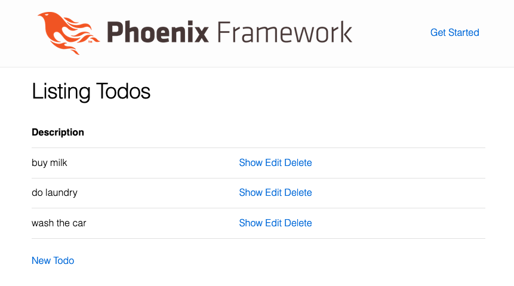
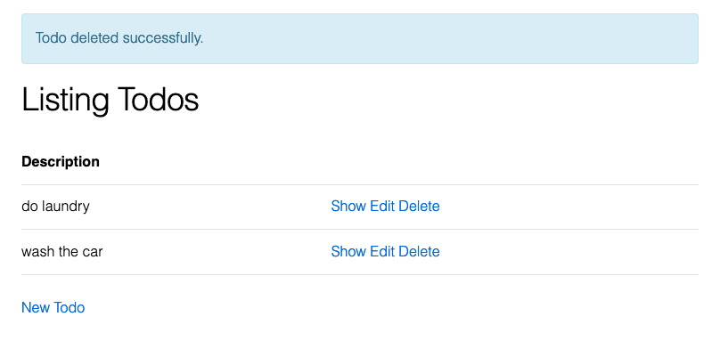

# Elixir Phoenix Docker PostgreSQL CRUD app
CRUD app implemented using Elixir, Phoenix, Docker and PostgreSQL.


----

----


## Setup
Use docker to setup postgres container.
```bash
sudo docker container run \
--name postgres \
-p 5432:5432 \
-e POSTGRES_PASSWORD=postgres \
-v poetic-postgres:/var/lib/postgresql/data \
--rm postgres:11-alpine
```

Mix new Phoenix project
```bash
mix phx.new todo_elixir
```

Setup Ecto with PSQL
```bash
cd todo_elixir && mix ecto.create
```
asdfa
Setup `/assets`
```bash
cd assets && npm install && node node_modules/webpack/bin/webpack.js --mode development
```

Generate Phoenix schema
```bash
mix phx.gen.schema Todo todos description
```

```bash
mix phx.gen.html Web Todo todos description
```

Ecto migrate
```bash
mix ecto.migrate
```

Edit `lib/todo_elixir_web/router.ex` and add line:
```
resources "/todos", TodoController
```

Start Phoenix server
```bash
mix phx.server
```

Goto: http://127.0.0.1:4000/todos
